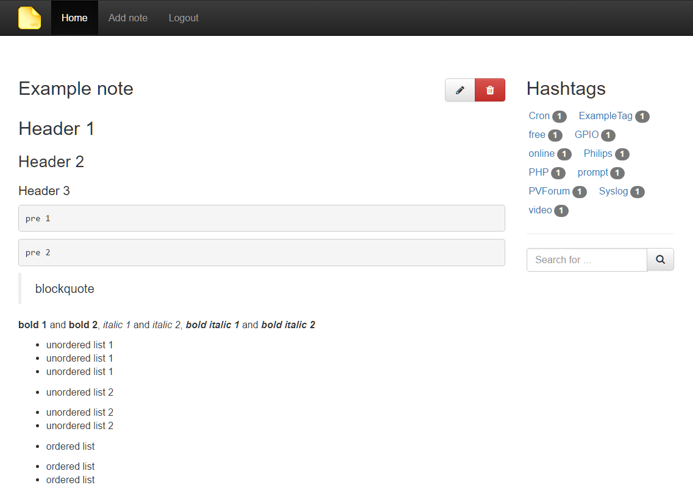
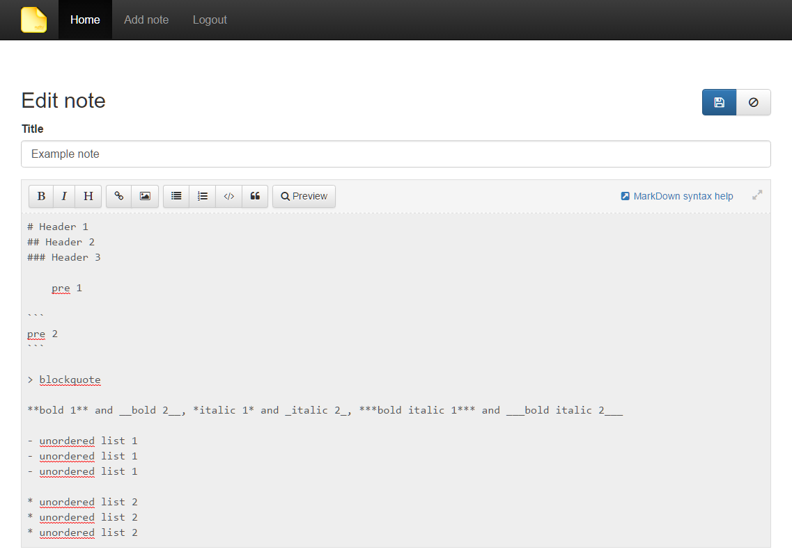
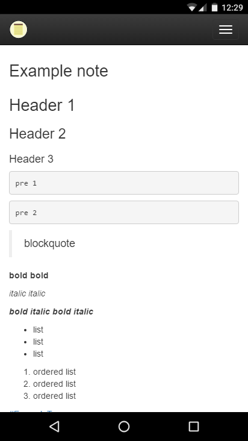

# Notes

### Simple Note taking application with **#HashTags**

## ScreenShots

### Desktop





### Mobile



## Install

- Clone the repository
- Set your document root to the ```public``` folder
- Create configuration file

    ```cp config/config.dist.php config/config.php```

- Change your settings, especially the database credentials
- Run Composer

    ```composer update```

- Import the SQL script from ```sql/notes.sql``` into your database

## Contribute

Fork the repo and make your changes

### Make a translation for your language

Prepare your translation file based on ```en.php```

    lang/translate.sh <Your2CharacterLangId>

Translate

### Make a pull request
