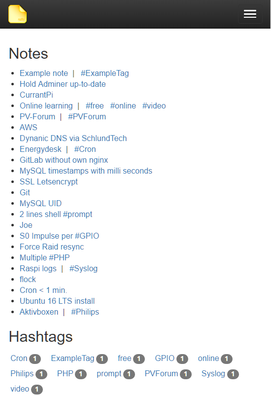

# Notes

### Simple Note taking application with **#HashTags**

## ScreenShots

### Desktop


### Mobile



## Install

- Clone the repository into your document root
- Create configuration file

    ```cp config.dist.php config.php```

- Change your settings, especially the database credentials
- Run Composer

    ```composer update```

- Import the SQL script from ```sql/notes.sql``` into your database

## Contribute

Fork the repo and make your changes

### Make a translation for your language

    cp lang/en.php lang/<YourLangId>.php

### Make a pull request
